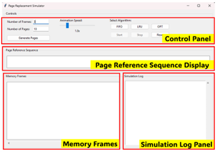
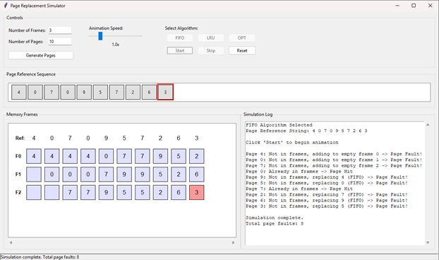
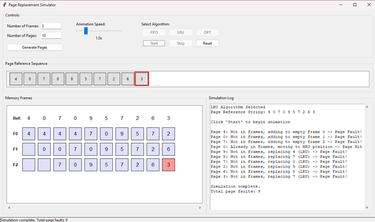
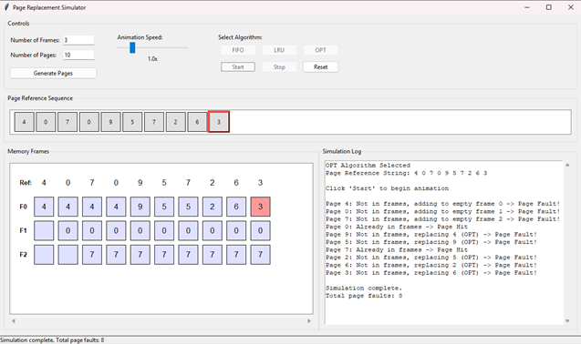

# Page Replacement Simulator

A visual simulator for understanding memory page replacement algorithms implemented using Python and Tkinter. This application helps in learning and comparing different page replacement algorithms: FIFO (First-In-First-Out), LRU (Least Recently Used), and OPT (Optimal).



## Features

- Interactive visualization of page replacement algorithms
- Support for three common page replacement algorithms:
  - FIFO (First-In-First-Out)
  - LRU (Least Recently Used)
  - OPT (Optimal)
- Customizable parameters:
  - Number of memory frames (1-10)
  - Number of page references (1-50)
  - Animation speed control (0.5x - 3.0x)
- Real-time visualization of:
  - Page reference sequence
  - Memory frame states
  - Page faults
- Detailed simulation log
- Animation controls (Start, Stop, Reset)
- Status bar for current operation feedback

## Requirements

- Python 3.x
- Tkinter (usually comes with Python)

## Installation

1. Clone this repository or download the source code
2. Install the required dependencies:
```powershell
pip install -r requirements.txt
```

## Usage

1. Run the application:
```powershell
python src/main.py
```

2. Configure the simulation:
   - Enter the number of memory frames (1-10)
   - Enter the number of pages to generate (1-50)
   - Click "Generate Pages" to create a random page reference sequence

3. Select an algorithm:
   - Click FIFO, LRU, or OPT button to choose the algorithm
   - Click "Start" to begin the simulation
   - Use the speed slider to adjust animation speed
   - Use "Stop" to pause and "Reset" to clear the simulation

## Algorithm Descriptions

### FIFO (First-In-First-Out)
- Pages are replaced in the order they were loaded into memory
- The oldest page in memory is replaced when a page fault occurs
- Simple to implement but may not perform optimally

### LRU (Least Recently Used)
- Replaces the page that hasn't been used for the longest time
- Tracks page usage history to make replacement decisions
- Generally performs better than FIFO
- More complex to implement in real systems

### OPT (Optimal)
- Replaces the page that won't be used for the longest time in the future
- Provides the theoretical best performance
- Not implementable in real systems (requires future knowledge)
- Used as a benchmark for comparing other algorithms

## UI Components

1. **Control Panel**
   - Frame count input
   - Page count input
   - Generate Pages button
   - Algorithm selection buttons
   - Animation speed control
   - Start/Stop/Reset buttons

2. **Page Reference Sequence**
   - Visual representation of the generated page sequence
   - Highlights current page during animation

3. **Memory Frames Display**
   - Shows current state of memory frames
   - Highlights frame changes during page replacements
   - Labels each frame for easy reference

4. **Simulation Log**
   - Detailed text log of operations   - Shows page hits and faults
   - Tracks replacement decisions
   - Auto-scrolls to show latest events

5. **Status Bar**
   - Shows current operation status
   - Displays algorithm state and progress
   - Shows total page fault count on completion

## Screenshots

### FIFO Algorithm Demo


### LRU Algorithm Demo


### OPT Algorithm Demo


## Building an Executable

To build a standalone executable:

```powershell
pyinstaller src/main.py
```

The executable will be created in the `dist` directory.

## Screenshots

### Main Interface

*Main application window showing control panel and visualization areas*

### FIFO Algorithm Demonstration

*FIFO page replacement algorithm in action with page fault visualization*

### LRU Algorithm Demonstration

*LRU algorithm showing page replacement based on usage history*

### OPT Algorithm Demonstration

*Optimal algorithm demonstrating theoretical best performance*


## Contributing

Feel free to contribute to this project by:
- Reporting bugs
- Suggesting enhancements
- Creating pull requests for new features or improvements

## License

This project is available for educational and personal use. Feel free to modify and distribute while providing appropriate attribution.